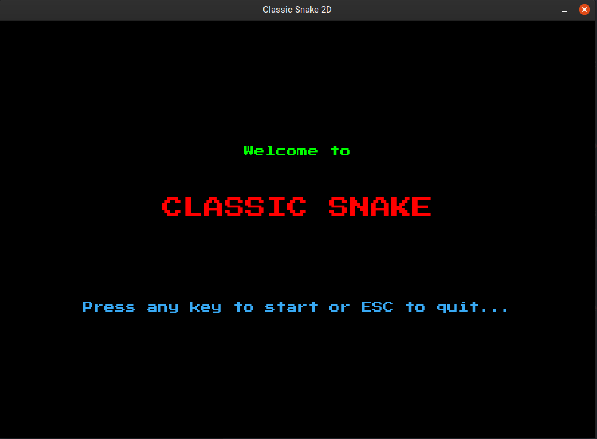
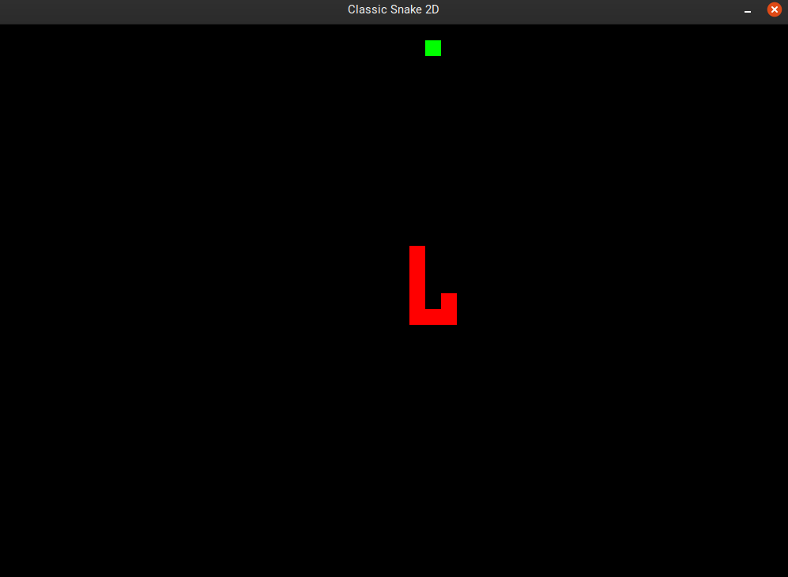
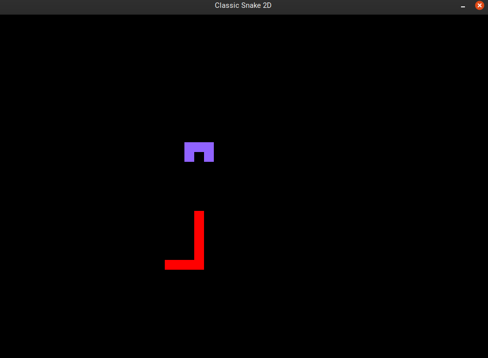
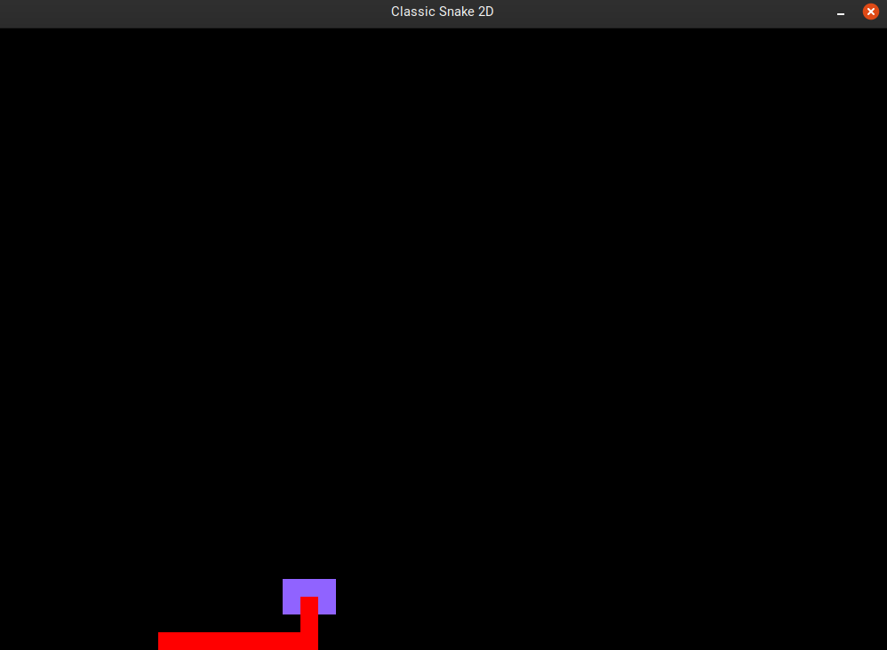
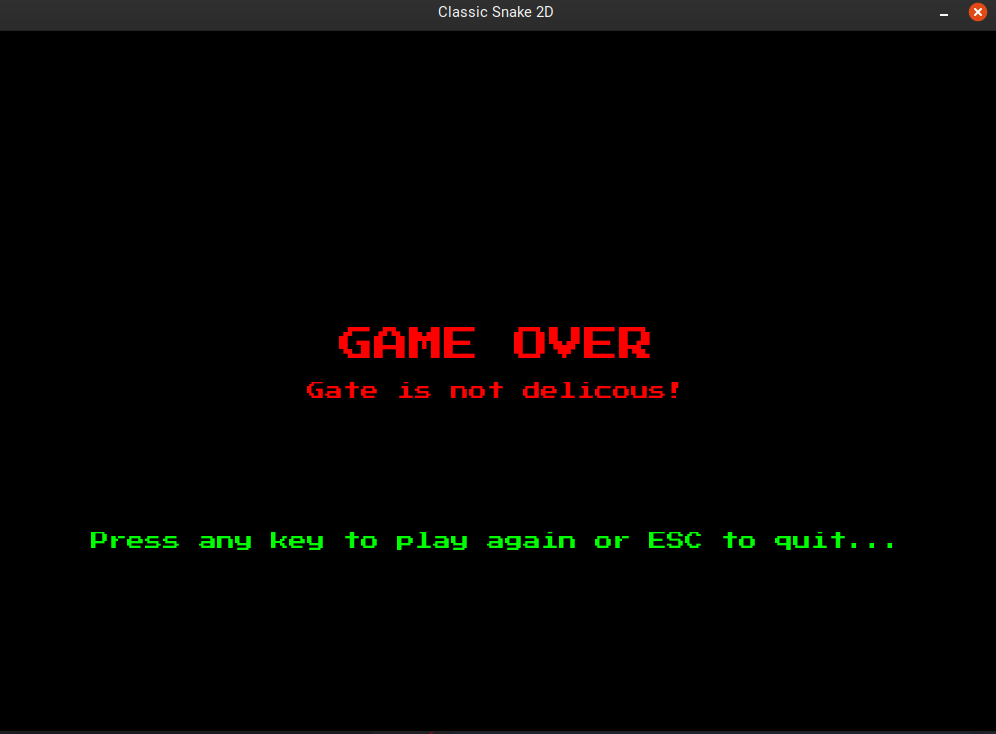
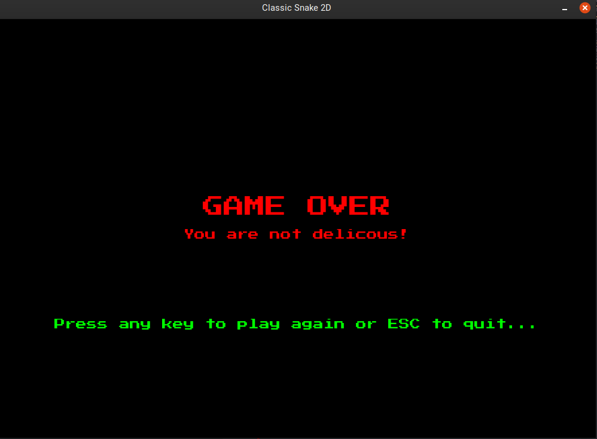

# SNAKE GAME WITH PYGAME

A Snake game built with Pygame. In this game, player will control
a snake to go around the screen and try to eat the fruit and go to the next level.

## Installation

__1. Install Python__

First, make sure you have Python3.7 installed on your computer. If you are using Ubuntu 18.04 or newer, Python is automatically installed so you can skip this step. To install Python3.7 on other OS, visit the [offical website](https://www.python.org/downloads/)

__2. Install pygame__

Once you have Python3.7 or newer installed on your computer,you need to install Pygame. Please refer to the [offcial document website](https://www.pygame.org/news) for how to install the library on different systems.

## Usage

In order to run the game, download all the file in this repository and put them in one folder. Then on the terminal, move to the directory containing all the downloaded files. Finally enter the following command:

`~$ python3 .py`

## How to play

When the game is first started, it will greet the player and ask the player to press any key to start or press ESC to 
quit the game like the following:

When the player presses any keys except from ESC, there will be a snake appears immediately on the screen along with the fruit for the snake to eat.

The player controls the snake and guides it toward the fruit using the following key:

* __W:__ go up
* __S:__ go down
* __A:__ go left
* __D:__ go right

When the snake has eaten a certain number of fruits, a gate will appear and the snake needs to go through it to get to the next level. 

The snake must go throught the gate throught the hole on it. If the snake stumbles on any edges of the gate, it will die and the player will loose the game.

When the snake has passed the gate succefully, the game speed will increase and the length of the snake will be kept the same.

If the snake bites itself or stumbles on the edges of the gate, it will die and there will be a message notify the player and ask them to play again or to quit.

The snake hits the gate:

The snake bites it self:

When the player aggrees to play again, the game will be reset to the initial state.

## License

The code in this project is licensed under MIT license.